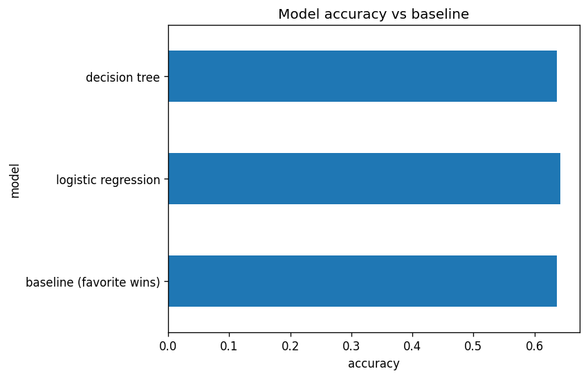
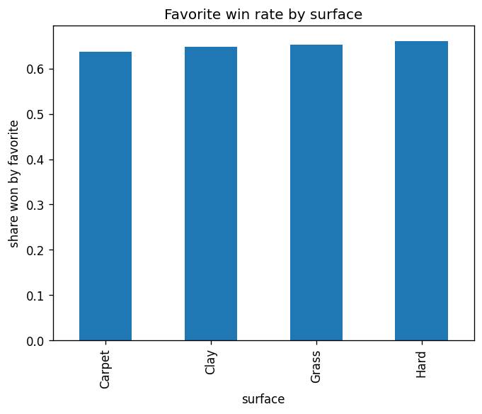

# Predicting ATP Match Outcomes with Machine Learning

Author: Roman Belchikov

This project explores whether historical ATP match data can be used to predict the likely winner of a tennis match before it begins. I compared a classic favorite-wins baseline against several machine-learning models, including logistic regression, tree-based models, and a neural network, using ranking, ranking points, age, and height as the main predictors.

## Project Summary

The main objective was to evaluate whether a more advanced model meaningfully improves on the baseline in real-world match prediction. In tennis, the favorite is often the player with the better ranking and more stable record, so the challenge is not simply to “beat chance,” but to determine whether a model provides a meaningful edge beyond a ranking-based rule.

**Key takeaway:** the best-performing models were only marginally better than the baseline and often within the same accuracy band. That strongly suggests the ranking gap contains most of the predictive signal in ATP match outcomes, while the remaining uncertainty is dominated by randomness and match-specific factors that are not available in the pre-match data.

---

## 1. Research Question

Can we predict who wins an ATP match using only pre-match information such as current ranking, ATP points, age, and height? More specifically, does a more sophisticated algorithm outperform a simple baseline that assumes the higher-ranked player wins?

---

## 2. Data and Methodology

The project uses a cleaned ATP dataset spanning multiple seasons and includes match-level player information such as:

- ranking
- ATP points
- age
- height
- match outcome

The modeling setup was designed to avoid data leakage and remain realistic in a forecasting setting. Inputs were built as differences between the two players, including:

- `rank_diff`
- `points_diff`
- `age_diff`
- `height_diff`

The target variable was a binary outcome indicating whether Player A won the match. I evaluated several models using a time-aware split, which is more appropriate than random shuffling for predicting future tennis results.

The models reviewed in this project include:

- baseline favorite-wins rule
- logistic regression
- decision tree
- random forest
- gradient boosting
- K-nearest neighbors
- linear SVM
- neural network

---

## 3. Model Comparison

| Model | Accuracy |
| --- | ---: |
| Baseline (favorite wins) | 0.637 |
| Logistic regression | 0.642 |
| Decision tree | 0.637 |
| Random forest | 0.641 |
| Gradient boosting | 0.641 |
| KNN | 0.629 |
| Linear SVM | 0.642 |
| Neural network | 0.642 |

This result is informative because the performance differences are very small. The neural network and logistic regression are in the same range as the baseline, which makes it clear that the gains from more complex architectures are limited in this setting.




---

## 4. Findings and Takeaways

The main conclusions from the research are as follows:

- The ranking gap is by far the most informative feature.
- Ranking points carry highly overlapping information and do not add much independent predictive value.
- Age and height contribute only a small amount of additional signal.
- More complex models do not offer a dramatic improvement over the simpler favorite-wins rule.
- Upsets are frequent enough that a hard predictability ceiling exists in tennis.

This means the real challenge is not merely choosing a better algorithm, but identifying the missing features that capture current form, head-to-head dynamics, surface-specific performance, fatigue, and injury conditions. Those variables are often the difference between a strong prediction and a surprise result.

---

## 5. Limitations

This project is deliberately conservative and intentionally limited to pre-match data. The model does not use:

- recent form
- head-to-head results
- surface-specific tendencies
- injury information
- scheduling or travel fatigue
- match-context variables

The dataset also merges multiple seasons, during which ranking systems and tournament structures evolved. That makes the prediction task more realistic but also imposes some constraints on model generalization.

---

## 6. Practical Interpretation

The project shows that ATP match outcomes are not perfectly predictable from static pre-match statistics alone. Rankings explain much of what is predictable, but the randomness of tennis remains significant. That is why the model can estimate probabilities reasonably well while still failing to consistently outperform a simpler favorite-based heuristic.

From a practical perspective, this suggests that the best use of the model is as a probability estimator rather than a certainty engine. It is useful for understanding who is favored, but not for assuming a match is “locked” based on rankings alone.

---

## 7. How to Run

```bash
pip install -r requirements.txt
```

Then open `tennis_predictor.ipynb` and run the cells in order, or run the Streamlit app:

```bash
streamlit run app.py
```

---

## 8. Repository Structure

```text
tennis-match-predictor/
├── README.md
├── app.py
├── train_model.py
├── model.joblib
├── requirements.txt
├── tennis_predictor.ipynb
├── data/
├── charts/
└── .venv/
```

---

## 9. Final Conclusion

The project confirms a central reality of tennis forecasting: rankings matter most, and the remaining unpredictability is not easily reduced with a static model. The neural network performs similarly to the simpler models, reinforcing the idea that ranking-based information dominates the signal in ATP match prediction.

This is not a failure of the modeling approach; it is a reflection of the sport itself. Tennis is highly competitive, highly context-sensitive, and often governed by variance that is difficult to capture without richer live data.

